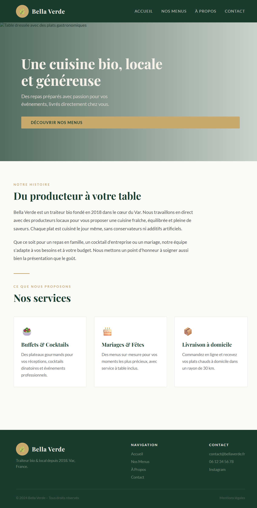

git add .
git commit -m "ajout README exercice"
git push# 🌿 Exercice HTML/CSS — Bella Verde Traiteur Bio

> Exercice pour grands débutants — Parcours DWWM

---

## 🎯 Objectif

Tu vas styliser une page HTML déjà écrite en créant ton propre fichier CSS **de zéro**.

Le HTML est fourni, le CSS est à toi de l'inventer !

---

## 👀 Le rendu final à reproduire



---

## 📁 Structure du projet

```
bella-verde-exercice/
├── css/
│   └── style.css          ← C'est ici que tu vas écrire ton CSS
├── image/                 ← Les images du site
├── index.html             ← Le HTML de base (ne pas modifier)
└── solution.html          ← La solution complète (à ne regarder qu'à la fin !)
```

---

## 🚀 Comment démarrer

**1. Clone le dépôt sur ton ordinateur**
```bash
git clone https://github.com/annega076/bella-verde-exercice.git
```

**2. Ouvre le dossier dans VS Code**
```bash
cd bella-verde-exercice
code .
```

**3. Lance Live Server**
- Installe l'extension **Live Server** dans VS Code si ce n'est pas fait
- Ouvre `index.html` puis clique sur **"Go Live"** en bas à droite

**4. Ouvre `css/style.css` et commence à coder !**

---

## 📝 Consignes

- ✅ Tu peux modifier **uniquement** le fichier `css/style.css`
- ✅ Observe bien l'image du rendu final pour t'en inspirer
- ✅ Utilise `index.html` pour voir l'avancement en temps réel
- ❌ Ne modifie pas le fichier `index.html`
- ❌ Ne regarde la solution qu'une fois ton exercice terminé !

---

## 💡 Pistes pour démarrer

Tu ne sais pas par où commencer ? Voici quelques propriétés CSS utiles pour cet exercice :

- `font-family` → changer la police
- `color` → couleur du texte
- `background-color` → couleur de fond
- `margin` et `padding` → espacement
- `text-align` → alignement du texte

---

## ✅ Tu as terminé ?

Compare ton résultat avec l'image fournie, puis jette un œil à `solution.html` pour voir une version possible. Il n'y a pas qu'une seule bonne réponse en CSS !

---

*Exercice créé dans le cadre du parcours DWWM — Bonne chance ! 💪*
